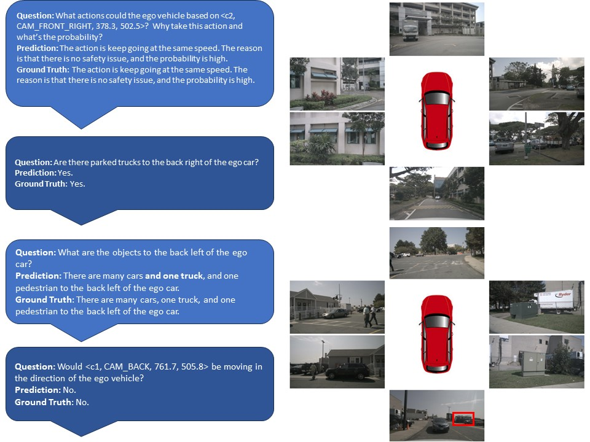
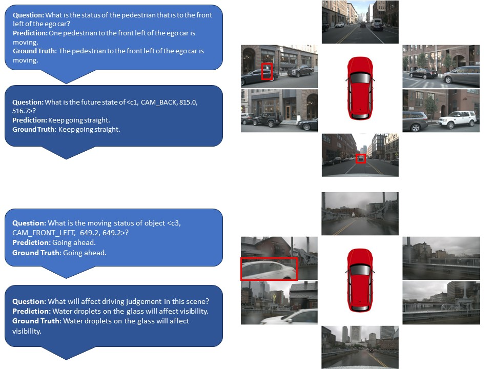

# EM-VLM4AD
<div style="display: flex;">
    
    
</div>

* This repository contains the code necessary to replicate the paper "[Efficient, Lightweight Multi-Frame Vision Language Model for Visual Question Answering in Autonomous Driving](https://arxiv.org/abs/2403.19838)", which was submitted to the Vision & Language for Autonomous Driving & Robotics Workshop at CVPR 2024.
* Authors: Akshay Gopalkrishnan, Ross Greer, and Mohan Trivedi
## Citation
If you find our code and research paper useful, please cite our paper as following:
```
@article{gopalkrishnan2024multi,
  title={Multi-Frame, Lightweight \& Efficient Vision-Language Models for Question Answering in Autonomous Driving},
  author={Gopalkrishnan, Akshay and Greer, Ross and Trivedi, Mohan},
  journal={arXiv preprint arXiv:2403.19838},
  year={2024}
}
```
## Installation
1. Clone this repository
2. In the repository directory, run `mkdir multi_frame_results`
3. To replicate our environment use the `env.yml` we have provided. The following commands should create a proper environment:
```
conda env create -f env.yml
conda activate EM-VLM4AD
```
## Model Weights
* You can download the model weights for the [T5-Based](https://drive.google.com/drive/folders/1K61Ou-m5c5UmN2ggT-Huw3rv7PhW5Wft?usp=sharing) and [T5-Large-Q](https://drive.google.com/drive/folders/12bHyRTpWWxIJ2pb0WWzfX5mMdkNHKMVP?usp=sharing) version of EM-VLM4AD at the following links. Put the folders for each of these models into the `multi_frame_results` folder. Your directory should look like the following:
```
└── rootFolder
 ├── multi_frame_results/
      ├── T5-Medium/
        ├── latest_model.pth
      ├── T5-Large/
        ├── latest_model.pth
```
## Dataset
First download the train/val/test split [here](https://drive.google.com/file/d/17p4EwArHh7-L4HSlGizsF_Ix_Y-sYxkw/view?usp=sharing) in your root folder. This will include data from the DriveLM dataset as well as the train/val/test splits we use for our experiments. The folder structure should now be as follows: 
```
└── rootFolder
  ├── data/
    ├── multi_frame/
      ├── multi_frame_train.json
      ├── multi_frame_val.json
      ├── multi_frame_test.json
      ├── multi_frame_test_coco.json
      ├── image_id.json
    ├── QA_dataset_nus/
      ├── v1_0_train_nus.json
    ├── nuscenes/
      ├── samples/
  ├── multi_frame_results/
      ├── T5-Medium/
      ├── T5-Large/
```
## Training
* To run training, run `python train.py --batch-size [BATCH SIZE] --epochs [EPOCHS] --lm {T5-Base, T5-Large}`. For more information on other hyperparameters such as loading checkpoints or altering learning rate, weight decay, or the hidden size for gated pooling attention, run `python train.py --help`.
## Inference
* For inference to generate BLEU-4, CIDEr, METEOR, and ROUGE_L metrics for trained models, you can run `python eval.py --batch-size [BATCH_SIZE] --lm {T5-Base, T5-Large} --checkpoint-file [CHECKPOINT_FOLDER]`. For more information on other hyperparameters to work for different model configurations, run `python eval.py --help`.
* We use the [pycocoevalcap](https://github.com/salaniz/pycocoevalcap) library to generate the caption metrics we evaluate on. For this library, Java needs to be installed on your computer. We also recommend commenting out [this line](https://github.com/salaniz/pycocoevalcap/blob/master/eval.py#L45) from the pycocoevalcap library to avoid generating SPICE metrics, which can take longer and don't work for multi-frame situations. 
## Running on Google Colab
If you want to run our code on Google Colab, we have provided three different notebooks in the `colab` folder that can be used for training each model type and inference:
* `train_T5_Base.ipynb`: Allows for training EM-VLM4AD with the T5-Medium LM backbone.
* `train_T5_Large.ipynb`: Allows for training EM-VLM4AD with the quantized T5-Large LM backbone. 
    * Training hyperparameters are in the `Hyperparameters` section of the training Colab notebooks. This can allow you to resume training from a checkpoint and whether the LM should be freezed during training.
* `eval.ipynb` Generates BLEU-4, METEOR, CIDER, and ROUGE_L metrics for a trained model. Make sure to specify model checkpoint being evaluated and what LM backbone is being used ('T5-Medium' or 'T5-Large') in the `Hyperparameters` section.
* We recommend making a folder `DriveLM` in your Google Drive and uploading the model checkpoints and zipped data to this folder. An example directory should look like this:
```
└── DriveLM
    ├── data.zip
    ├── multi_frame_results/
      ├── T5-Medium/
      ├── T5-Large/
```
